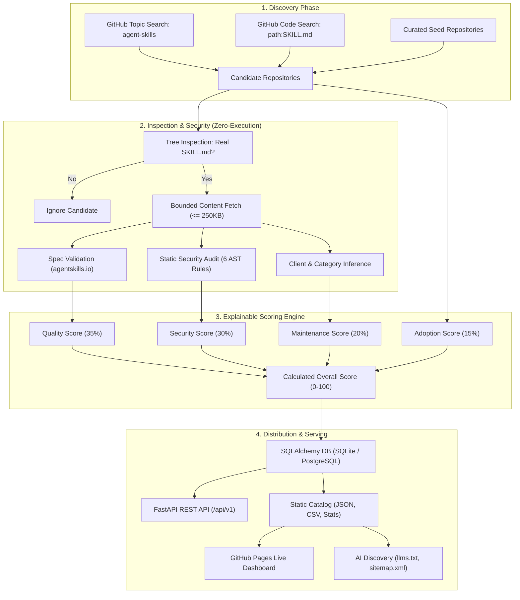

# Agent Skill Observatory

[](https://opensource.org/licenses/Apache-2.0)
[](https://github.com/imMamdouhaboammar/agent-skill-observatory/actions/workflows/ci.yml)
[](https://www.python.org/downloads/)
[](https://github.com/imMamdouhaboammar/agent-skill-observatory)
[](https://imMamdouhaboammar.github.io/agent-skill-observatory/)
[](https://github.com/imMamdouhaboammar)
[](https://agentskills.io/specification)

A production-grade discovery, specification validation, static security auditing, explainable scoring, and publishing platform for the open Agent Skills ecosystem.

It answers the critical questions for modern AI agent toolchains:

> **Which repositories contain actual, valid Agent Skills? What evidence supports each manifest? How closely does each skill adhere to open specifications? What static security or permission risks are present? How actively maintained is the repository, and why is the skill ranked where it is?**

---

## Live Web Dashboard & Discovery

Explore the live catalog directly on GitHub Pages:  
:point_right: **[https://imMamdouhaboammar.github.io/agent-skill-observatory/](https://imMamdouhaboammar.github.io/agent-skill-observatory/)**

- **Interactive Search & Filter**: Real-time filtering across skill names, categories, client compatibility tags, and security levels.
- **Detailed Findings Modal**: Inspect exact AST security warnings, file count distributions, token counts, and manifest provenance links.
- **Instant Scan Copy**: Copy one-click local scan commands for any indexed skill.
- **AI-Readable Endpoints**: Served natively with [`llms.txt`](https://imMamdouhaboammar.github.io/agent-skill-observatory/llms.txt) and [`llms-full.txt`](https://imMamdouhaboammar.github.io/agent-skill-observatory/llms-full.txt) for LLM crawlers and research agents.

---

## Awesome Directory on GitHub

The verified catalog is also published directly inside this repository as structured Markdown and data:

- [`catalog/skills/`](./catalog/skills/) contains the canonical published record for each Skill and is the publication source of truth.
- [`AWESOME.md`](./AWESOME.md) is the complete aggregate directory of verified Agent Skills and repositories.
- [`awesome/README.md`](./awesome/README.md) is the browsable GitHub directory index maintained by per-Skill publication events.
- [`data/catalog.json`](./data/catalog.json) contains the aggregate skill-level records and evidence.
- [`data/repositories.json`](./data/repositories.json) contains aggregate repository-level rollups.

Publication is atomic per semantic Skill event. Each add, update, reindex, or confirmed removal is committed directly to `main` as one Skill commit using a fast-forward-only ref update. The publisher retries conflicts from the latest published state and never force-updates `main`.

The scheduled refresh checks GitHub every 15 minutes. After the bounded Skill event loop, `AWESOME.md` and `data/*` are rebuilt as reproducible materialized views. Aggregate files are not used to decide whether a Skill changed, and a timestamp-only refresh does not create a catalog commit. The root README remains human-owned outside the generated marker block below.

<!-- AWESOME_INDEX_START -->
Published skills: **687**
Repositories: **73**
Latest Skill event: **add** · `componentdock/free-react-templates:.opencode/skills/openspec-update-change`

[Browse the GitHub directory](./awesome/README.md) · [Open AWESOME.md](./AWESOME.md)
<!-- AWESOME_INDEX_END -->

---

## Key Features

- **Strict Manifest Grounding**: Requires a real `SKILL.md` before a skill can be cataloged. No indexing empty or keyword-stuffed repos.
- **Comprehensive Spec Validation**: Strictly validates Agent Skills specification parameters (name syntax, description length, allowed properties).
- **Multi-Vector Static Security Scanner**: Audits instructions and bundled code for high-risk vectors (piped curl-to-bash, destructive `rm -rf`, raw credentials/keys, dynamic `eval`/`exec`, `chmod 777`, `sudo` escalation).
- **Explainable, Uncoupled Scoring**: Keeps Quality (35%), Security (30%), Maintenance (20%), and Adoption (15%) distinct. Archived repos are capped below 50.
- **Multi-Agent Universal Standard (OmniSkill)**: Plug-and-play compatibility across Antigravity, Claude Code, Cursor, Codex, OpenCode, and Skills.sh.
- **Content Deduplication**: Normalized SHA-256 fingerprinting clusters identical manifests across fork storms and re-uploads.
- **Zero-Execution Crawler**: Strictly static inspection. Never executes third-party scripts, commands, or installers during discovery.
- **Dual Deployment**: Runs as a lightweight local CLI, a production FastAPI REST API, or a GitHub Actions + Pages serverless static application.
- **Universal Data Exports**: Programmatic consumption via SQLite, PostgreSQL, JSON (`data/catalog.json`), and CSV (`data/catalog.csv`).

---

## Architecture & Pipeline



---

## Quick Start

### 1. Universal Installer (Recommended)

Install `skillobs` directly via curl or bun:

```bash
curl -fsSL https://raw.githubusercontent.com/imMamdouhaboammar/agent-skill-observatory/main/install.sh | bash
```

Or via Bun / NPM:
```bash
bun add -g agent-skill-observatory
# or
npx agent-skill-observatory --help
```

### 2. Python Environment (3.11+)

```bash
git clone https://github.com/imMamdouhaboammar/agent-skill-observatory.git
cd agent-skill-observatory
python -m venv .venv
source .venv/bin/activate
pip install -e ".[dev]"
```

### 3. Scan a Local Skill Before Using

Audit any local skill directory before installing it into your AI agent environment:

```bash
skillobs scan-local path/to/my-skill
```

Output:
```json
{
  "name": "my-custom-skill",
  "spec_version": "0.1.0",
  "spec_valid": true,
  "scores": {
    "overall": 92.5,
    "quality": 95.0,
    "security": 100.0,
    "maintenance": 80.0,
    "adoption": 85.0
  },
  "security_findings": [],
  "inferred_clients": ["claude-code", "codex", "antigravity"]
}
```

---

## Running the Web Product & API

### Local FastAPI Server

```bash
cp .env.example .env
skillobs init-db
skillobs refresh --max-repositories 25
skillobs serve --host 127.0.0.1 --port 8000
```

- **Web Dashboard**: `http://127.0.0.1:8000`
- **Interactive Swagger Docs**: `http://127.0.0.1:8000/docs`
- **ReDoc**: `http://127.0.0.1:8000/redoc`

### Docker Compose

```bash
docker compose up --build
```
Runs in a non-root Alpine container with automated Alembic migrations and built-in healthcheck.

---

## Multi-Agent Universal Integration

Agent Skill Observatory adheres to the open multi-agent format (`SKILL.md` + `skill.package.json`).

| Platform | Location / Method |
|---|---|
| **Antigravity / Gemini CLI** | Native skill in `.agents/skills/agent-skill-observatory/SKILL.md` |
| **Claude Code** | Load via `marketplace.json` or `.claude/skills/` |
| **Cursor / Codex** | Drop into `.agents/skills/` |
| **OpenCode** | Referenced in `skill.package.json` |
| **Skills.sh** | Registered in `.skills.json` |

---

## CLI Reference

```text
skillobs init-db                     Initialize clean database schema
skillobs migrate                     Apply Alembic migrations to current database
skillobs scan-local PATH             Audit and score a local skill directory
skillobs refresh [--max-repositories N] Crawl GitHub and refresh observations
skillobs publish-events --repository owner/repo [--max-events N] Publish atomic Skill events and aggregate views
skillobs publish                     Regenerate local/service aggregate catalog files
skillobs export OUTPUT --format json|csv  Export current catalog snapshot
skillobs stats [--output stats.json] Export high-level ecosystem metrics
skillobs build-site --output-dir site Build static dashboard for Pages
skillobs doctor                      Verify configuration, database, and GitHub API
skillobs serve [--port 8000]         Launch FastAPI web product
```

---

## REST API Reference

| Endpoint | Method | Description |
|---|---|---|
| `/api/v1/health` | `GET` | Service status, database connectivity, and version |
| `/api/v1/stats` | `GET` | Ecosystem metrics (total skills, average score, categories) |
| `/api/v1/skills` | `GET` | Paginated skill query (`q`, `category`, `client`, `min_score`, `spec_valid`) |
| `/api/v1/skills/{id}` | `GET` | Detailed metadata, full provenance, and security breakdown |

All responses are hardened with strict security headers:
- `X-Content-Type-Options: nosniff`
- `X-Frame-Options: DENY`
- `Referrer-Policy: strict-origin-when-cross-origin`

---

## Scoring Methodology

Component scores are computed independently without collapsing into an unexplained vanity metric:

| Metric | Weight | Key Evidence Factors |
|---|---|---|
| **Quality** | 35% | Description length and clarity, instruction depth, presence of tests/evals, example workflows, README documentation. |
| **Security** | 30% | Static pattern inspection: curl-to-bash (-40), recursive deletion (-30), hardcoded credentials (-35), dynamic eval (-25), chmod 777 (-20), sudo escalation (-15). |
| **Maintenance** | 20% | Days since last commit, open issue ratio, archive status penalty (capped < 50 overall). |
| **Adoption** | 15% | Star count (log-scaled), fork count, historical momentum velocity across snapshots. |

Full formula and calibration criteria are documented in [`docs/scoring.md`](docs/scoring.md).

---

## Security & Provenance Invariants

1. **Zero Dynamic Execution**: Crawler and validator treat all third-party code as untrusted input. No scripts, shells, or binaries are executed.
2. **Strict Provenance**: Every indexed entry retains its exact GitHub repository, commit SHA, file path, and discovery query.
3. **Bounded File & Resource Limits**: Prevents denial of service by rejecting files > 250 KB and repositories exceeding reasonable tree depth.
4. **Credential Isolation**: Tokens and secrets are never logged, stored in databases, or included in JSON/CSV exports.
5. **Alembic-Backed Migrations**: Production database schemas are strictly version-controlled with zero unmanaged schema drift.

---

## Development & Testing

Run the full validation suite (Ruff, Mypy strict, Alembic migration verification, and Pytest with 80%+ coverage gate):

```bash
make verify
```

Other development targets:
```bash
make lint              # Ruff check and formatting validation
make typecheck         # Mypy strict type checking
make test              # Pytest with coverage reporting
make migration-check   # Alembic revision verification
make build-site        # Generate static web dashboard
```

---

## Citation

If you use Agent Skill Observatory in academic research, security audits, or agent evaluation frameworks, please cite:

```bibtex
@software{aboammar_agent_skill_observatory_2026,
  author       = {Mamdouh Aboammar},
  title        = {Agent Skill Observatory: Evidence-based discovery, specification validation, static security auditing, and ranking for open Agent Skills},
  year         = {2026},
  publisher    = {GitHub},
  journal      = {GitHub repository},
  howpublished = {\url{https://github.com/imMamdouhaboammar/agent-skill-observatory}}
}
```

---

## Author & Copyright

**Agent Skill Observatory** is designed, authored, and maintained by:

**Mamdouh Aboammar**  
- Email: [mamdouhfces1997@gmail.com](mailto:mamdouhfces1997@gmail.com)  
- GitHub: [@imMamdouhaboammar](https://github.com/imMamdouhaboammar)

Copyright (c) 2026 Mamdouh Aboammar. All rights reserved.

---

## License

Licensed under the [Apache License, Version 2.0](LICENSE).